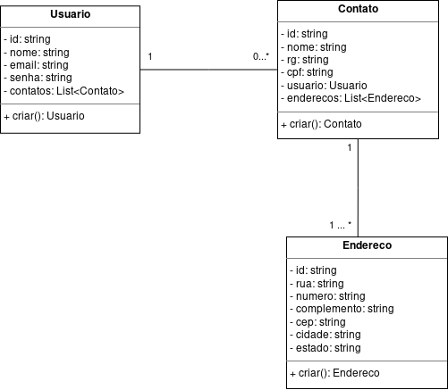
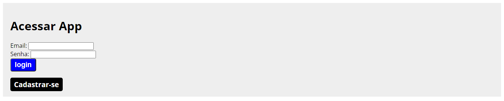
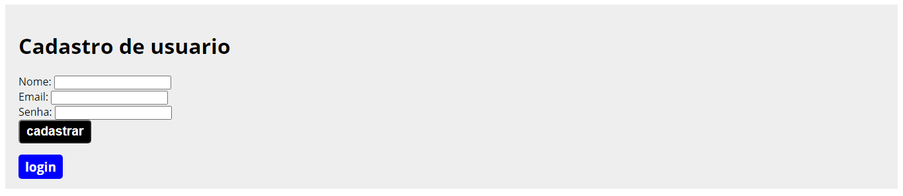
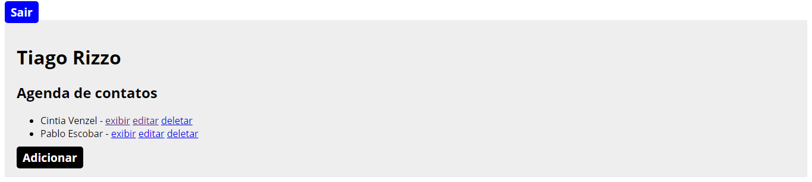
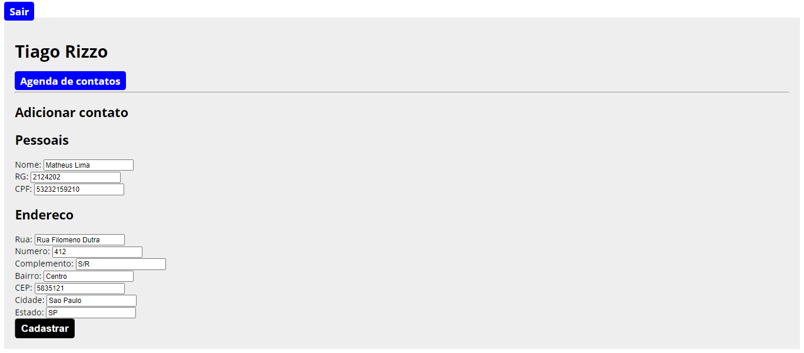
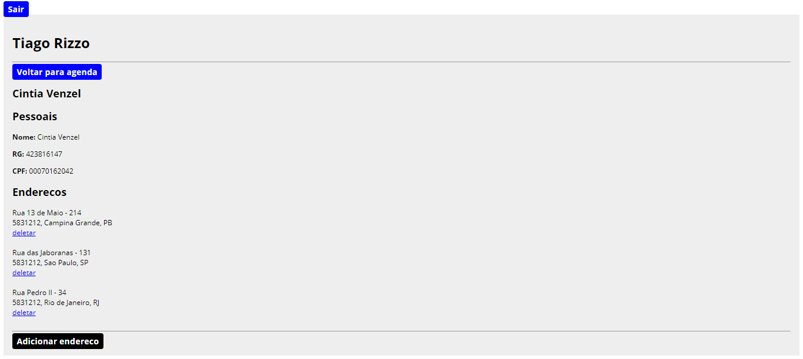
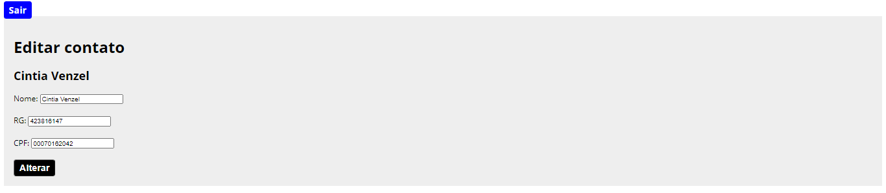
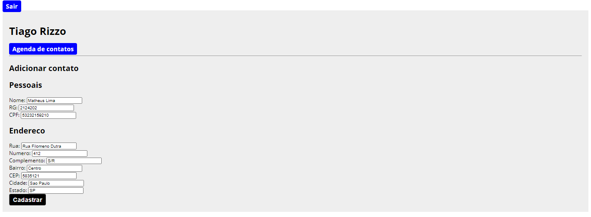

# Agenda de contatos

> **Agenda de contatos** é uma aplicação para registrar contatos. 

## Autores

-   Edivam Enéas de Almeida Júnior 
-   Joab da Silva Maia

## Tecnologias

  

**Java**, **HTML**, **CSS** com uma arquitetura **MVC**.

## Persistência & outras informações

Os dados são persistidos em memória e a estratégia de gerar ids é utilizando o pacote UUID.

## Diagrama

## Testes

Para rodar a aplicação é necessário:

-   Apache Tomcat. Sugestão: versão 9.0.52
-   JSP

### Usuário de teste

Login: tiago@gmail.com 
Senha: tiago

## Telas

Default

Login

Cadastro do usuário

Agenda de contatos

Cadastro de contato

Visualização dos dados do contato

Editar contato

Adicionar endereço

