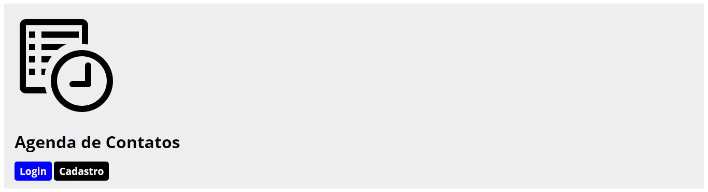
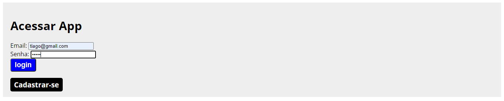

# Agenda de contatos

> **Agenda de contatos** é uma palicalçao para registrar contatos. 

## Tecnologias

**Java**, **HTML**, **CSS** com uma arquitetura **MVC**.

  

## Telas

Tela default

Tela de login

Tela de cadastro do usuário

Tela de agenda de contatos

Tela de cadastro de contato

Tela de visualização dos dados do contato

Tela de editar contato

Tela de adicionar endereço

## Autores

Edivam Enéas de Almeida Júnior 
Joab da Silva Maia
